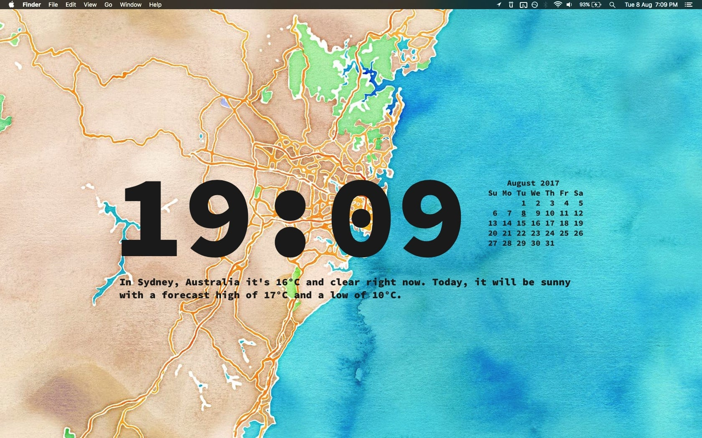

# My Übersicht Widgets

## Features

* 🕐 **Clock:** smartly only repaints once per minute (to save battery 💪🔋).
* 📆 **Calendar:** highlights current day.
* 🌤️ **Weather:** uses the current location (needs Wifi) and the Dark Sky API to get a weather forecast. After 9 PM it shows the forecast for next day.
* 👨🏻‍💻 **Dirty Git Repos:** shows a list of all git repositories that have uncommitted file changes.

_The font in the screenshots is [Source Code Pro](https://github.com/adobe-fonts/source-code-pro). On the second screenshot, [Satellite Eyes](https://github.com/tomtaylor/satellite-eyes) is used to get a location based wallpaper._

## Installation

1. Clone this repository.
2. Open `get-weather.js` and enter your Dark Sky API key (get one [here](https://darksky.net/dev)).
3. Open the Übersicht preferences and change the widgets folder to the one called `widgets` in this repository.

_**optionally:**_

4. Install the font "Source Code Pro": `cask install caskroom/fonts/font-source-code-pro`.
5. Change your background to `#1e1e1e` to make the status bar look invisible, or install Satellite Eyes: `cask install satellite-eyes`.
